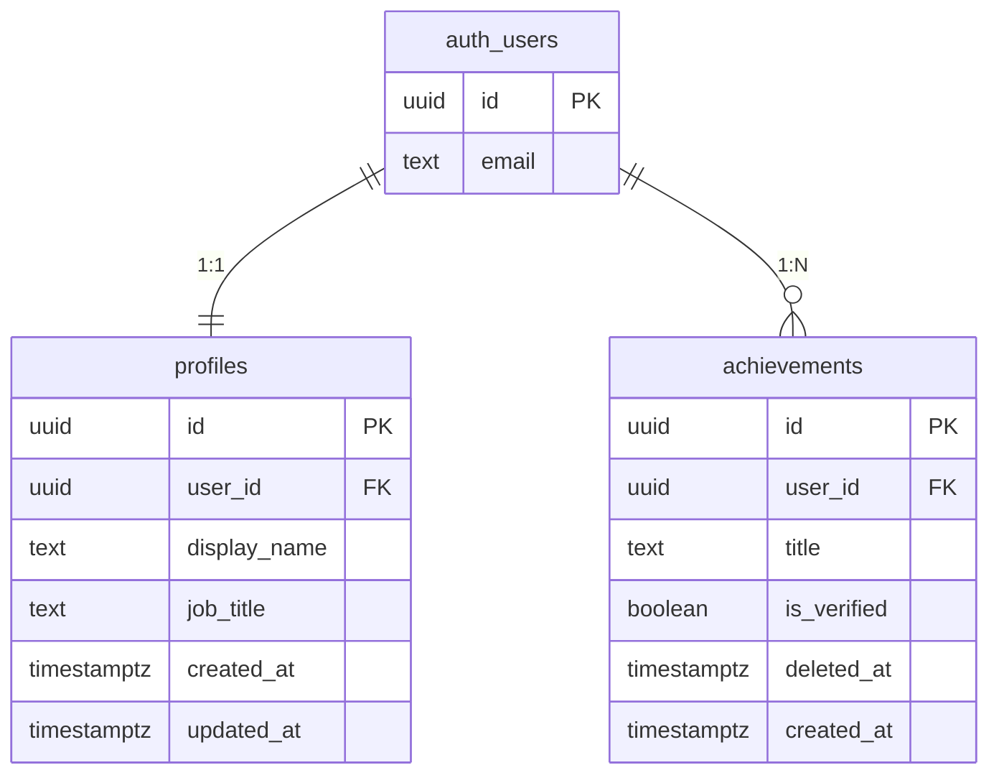

Supabase PostgreSQL 스키마를 설계할 때 아래 규칙을 반드시 따릅니다.

## 명명 규칙

| 대상 | 규칙 | 예시 |
|------|------|------|
| 테이블명 | snake_case, 복수형 | `profiles`, `checkin_sessions` |
| 컬럼명 | snake_case | `created_at`, `user_id` |
| 기본키 | `id` (uuid) | `id uuid PRIMARY KEY DEFAULT uuid_generate_v4()` |
| auth 외래키 | `user_id` → `auth.users(id)` | `user_id uuid REFERENCES auth.users(id)` |
| 일반 외래키 | `{참조테이블_단수}_id` | `profile_id`, `achievement_id` |
| 인덱스명 | `idx_{테이블}_{컬럼}` | `idx_profiles_user_id` |
| RLS 정책명 | `"{테이블}: {역할} {동작}"` | `"profiles: 본인 SELECT"` |
| ENUM 타입명 | `public.{도메인}_{속성}` | `public.checkin_quarter` |
| 트리거 함수명 | `fn_{동작}` | `fn_set_updated_at` |
| 트리거명 | `trg_{테이블}_{이벤트}` | `trg_profiles_updated_at` |

---

## 공통 컬럼 (모든 테이블 필수)

```sql
id         uuid         PRIMARY KEY DEFAULT uuid_generate_v4()
created_at timestamptz  NOT NULL DEFAULT now()
updated_at timestamptz  NOT NULL DEFAULT now()
```

**auth.users 연결 테이블**:
```sql
user_id    uuid  NOT NULL UNIQUE REFERENCES auth.users(id) ON DELETE CASCADE
```

**Soft Delete 지원 테이블**:
```sql
deleted_at timestamptz  NULL DEFAULT NULL  -- NULL = 활성, 값 있음 = 삭제
```

---

## 데이터 타입 선택 기준

| 용도 | 타입 | 이유 |
|------|------|------|
| 기본키 | `uuid` | Supabase 표준, 분산 환경 안전 |
| auth 참조 | `uuid REFERENCES auth.users(id)` | Supabase Auth 연동 |
| 짧은 문자열 | `text` | PostgreSQL에서 VARCHAR 성능 차이 없음 |
| 긴 텍스트 | `text` | 길이 제한 없음 |
| 금액 (만원) | `integer` | 소수점 없는 만원 단위 |
| 비율/점수 | `numeric(5, 2)` | 부동소수점 오차 방지 |
| 상태값 | `public.{name} ENUM` | 명시적 제약, 타입 안정성 |
| 불린 | `boolean` | PostgreSQL 네이티브 |
| JSON 구조 | `jsonb` | 인덱싱 가능, 쿼리 가능 |
| 날짜+시간 | `timestamptz` | UTC 시간대 포함 저장 |
| 날짜만 | `date` | 시간 불필요 시 |
| 소정수 | `smallint` | 연도, 경력 연수 등 |

---

## updated_at 자동 갱신 트리거

```sql
-- 공통 트리거 함수 (한 번만 생성)
CREATE OR REPLACE FUNCTION public.fn_set_updated_at()
RETURNS trigger LANGUAGE plpgsql AS $$
BEGIN
  NEW.updated_at = now();
  RETURN NEW;
END;
$$;

-- 각 테이블에 등록
CREATE TRIGGER trg_{테이블}_updated_at
  BEFORE UPDATE ON public.{테이블}
  FOR EACH ROW EXECUTE FUNCTION public.fn_set_updated_at();
```

---

## RLS (Row Level Security) 설계 원칙

### 활성화

```sql
-- 모든 테이블에 RLS 활성화 필수
ALTER TABLE public.{테이블} ENABLE ROW LEVEL SECURITY;
```

### 정책 패턴

```sql
-- 패턴 1: 본인 데이터만 전체 CRUD
CREATE POLICY "{테이블}: 본인 SELECT"
  ON public.{테이블} FOR SELECT TO authenticated
  USING (user_id = auth.uid());

CREATE POLICY "{테이블}: 본인 INSERT"
  ON public.{테이블} FOR INSERT TO authenticated
  WITH CHECK (user_id = auth.uid());

CREATE POLICY "{테이블}: 본인 UPDATE"
  ON public.{테이블} FOR UPDATE TO authenticated
  USING (user_id = auth.uid())
  WITH CHECK (user_id = auth.uid());

-- 패턴 2: 관계 테이블 (profiles.id 경유)
CREATE POLICY "profile_skills: 본인 SELECT"
  ON public.profile_skills FOR SELECT TO authenticated
  USING (
    profile_id IN (SELECT id FROM public.profiles WHERE user_id = auth.uid())
  );

-- 패턴 3: 읽기는 모두 허용, 쓰기는 서비스 롤만
CREATE POLICY "skills: 인증 유저 SELECT"
  ON public.skills FOR SELECT TO authenticated
  USING (true);
-- INSERT는 service_role만 (정책 없음 = 차단)

-- 패턴 4: 양측 당사자 접근 (peer_verifications 등)
CREATE POLICY "peer_verifications: 당사자 SELECT"
  ON public.peer_verifications FOR SELECT TO authenticated
  USING (requester_id = auth.uid() OR verifier_id = auth.uid());
```

### SECURITY DEFINER RPC (RLS 우회 필요 시)

```sql
-- AI가 삽입하거나, 복잡한 트랜잭션이 필요한 경우
CREATE OR REPLACE FUNCTION public.fn_example()
RETURNS void
LANGUAGE plpgsql
SECURITY DEFINER
SET search_path = public
AS $$
BEGIN
  -- 이 함수 내부는 함수 소유자(postgres) 권한으로 실행
  INSERT INTO checkin_questions (...) VALUES (...);
END;
$$;

-- 인증된 유저에게 실행 권한 부여
GRANT EXECUTE ON FUNCTION public.fn_example() TO authenticated;
```

---

## 인덱스 전략

```sql
-- 기본: 외래키에 반드시 인덱스
CREATE INDEX IF NOT EXISTS idx_{테이블}_{컬럼}
  ON public.{테이블} ({컬럼});

-- 복합 인덱스: 자주 함께 조회되는 컬럼
CREATE INDEX IF NOT EXISTS idx_checkin_sessions_user_quarter_year
  ON public.checkin_sessions (user_id, quarter, year);

-- 텍스트 검색: trigram 인덱스
CREATE INDEX IF NOT EXISTS idx_skills_name_trgm
  ON public.skills USING gin (name gin_trgm_ops);

-- 정렬이 있는 조회
CREATE INDEX IF NOT EXISTS idx_market_value_snapshots_user_calculated_at
  ON public.market_value_snapshots (user_id, calculated_at DESC);
```

---

## 테이블 명세 작성 형식

```markdown
### 테이블: profiles (커리어 프로필)

| 컬럼명 | 타입 | 제약조건 | 설명 |
|--------|------|----------|------|
| id | uuid | PK, DEFAULT uuid_generate_v4() | 프로필 고유 ID |
| user_id | uuid | NOT NULL, UNIQUE, FK → auth.users | Supabase 인증 유저 |
| display_name | text | NULL | 표시 이름 |
| job_title | text | NULL | 직함 |
| company | text | NULL | 현재 재직 회사 |
| years_of_exp | smallint | CHECK >= 0 | 총 경력 연수 |
| bio | text | NULL | 자기소개 |
| completeness | smallint | NOT NULL DEFAULT 0, CHECK 0~100 | 프로필 완성도 (%) |
| created_at | timestamptz | NOT NULL DEFAULT now() | 생성 일시 |
| updated_at | timestamptz | NOT NULL DEFAULT now() | 수정 일시 |

**RLS 정책**
- SELECT: `user_id = auth.uid()` (본인만)
- UPDATE: `user_id = auth.uid()` (본인만)
- INSERT: `fn_handle_new_user` 트리거가 가입 시 자동 생성

**인덱스**
- `idx_profiles_user_id` (user_id)

**트리거**
- `trg_profiles_updated_at` → `fn_set_updated_at()`
```

---

## 신규 유저 자동 프로비저닝 패턴

```sql
-- auth.users INSERT 시 profiles + 설정 테이블 자동 생성
CREATE OR REPLACE FUNCTION public.fn_handle_new_user()
RETURNS trigger LANGUAGE plpgsql SECURITY DEFINER SET search_path = public AS $$
BEGIN
  INSERT INTO public.profiles (user_id, display_name)
  VALUES (NEW.id, COALESCE(NEW.raw_user_meta_data->>'full_name', NEW.email))
  ON CONFLICT (user_id) DO NOTHING;

  INSERT INTO public.notification_settings (user_id)
  VALUES (NEW.id)
  ON CONFLICT (user_id) DO NOTHING;

  RETURN NEW;
END;
$$;

CREATE TRIGGER trg_on_auth_user_created
  AFTER INSERT ON auth.users
  FOR EACH ROW EXECUTE FUNCTION public.fn_handle_new_user();
```

---

## ERD Mermaid 작성 형식


