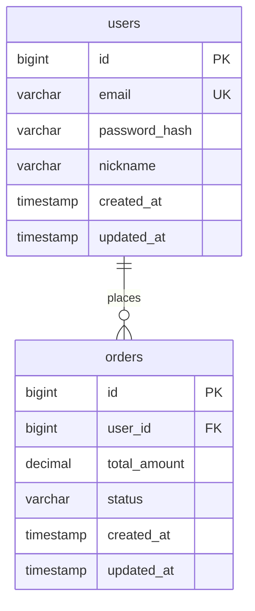

DB 스키마를 설계할 때 아래 규칙을 반드시 따릅니다.

## 명명 규칙

| 대상 | 규칙 | 예시 |
|------|------|------|
| 테이블명 | snake_case, 복수형 | `users`, `order_items` |
| 컬럼명 | snake_case | `created_at`, `user_id` |
| 기본키 | `id` (BIGINT) | `id` |
| 외래키 | `{참조테이블_단수}_{id}` | `user_id`, `product_id` |
| 인덱스명 | `idx_{테이블}_{컬럼}` | `idx_users_email` |
| 유니크 제약 | `uq_{테이블}_{컬럼}` | `uq_users_email` |
| 복합 인덱스명 | `idx_{테이블}_{컬럼1}_{컬럼2}` | `idx_orders_user_id_status` |

---

## 공통 컬럼 (모든 테이블 필수 포함)

```sql
id         BIGINT       PRIMARY KEY AUTO_INCREMENT  -- 고유 식별자
created_at TIMESTAMP    NOT NULL DEFAULT NOW()      -- 레코드 생성 일시
updated_at TIMESTAMP    NOT NULL DEFAULT NOW()      -- 마지막 수정 일시
                        ON UPDATE NOW()
```

소프트 삭제가 필요한 테이블에는 추가:
```sql
deleted_at TIMESTAMP    NULL DEFAULT NULL           -- 삭제 일시 (NULL이면 활성)
```

---

## 데이터 타입 선택 기준

| 용도 | 타입 | 이유 |
|------|------|------|
| 기본키 / 외래키 | `BIGINT UNSIGNED` | 대규모 데이터 대비 |
| 짧은 문자열 (이메일, 이름) | `VARCHAR(255)` | 가변 길이로 공간 효율 |
| 긴 텍스트 (설명, 본문) | `TEXT` | 길이 제한 없음 |
| 가격 / 금액 | `DECIMAL(15, 2)` | 부동소수점 오차 방지 |
| 상태값 (소수 종류) | `ENUM` 또는 `VARCHAR(50)` | 명시적 제약 |
| 불린 | `TINYINT(1)` | MySQL 호환성 |
| JSON 구조 데이터 | `JSON` | 스키마 유연성 필요 시 |
| 날짜+시간 | `TIMESTAMP` | UTC 기준 저장 |
| 날짜만 | `DATE` | 시간 불필요 시 |

---

## 인덱스 전략

### 인덱스 생성 기준
- **WHERE 절에 자주 등장하는 컬럼**: 단일 인덱스
- **JOIN에 사용되는 외래키**: 반드시 인덱스 생성
- **ORDER BY, GROUP BY에 사용되는 컬럼**: 인덱스 고려
- **카디널리티가 높은 컬럼 우선** (성별보다 이메일이 인덱스 효율 높음)

### 복합 인덱스 컬럼 순서
```
(카디널리티 높은 컬럼) → (범위 조건 컬럼) → (정렬 컬럼)
```

### 인덱스 금지 케이스
- 쓰기(INSERT/UPDATE)가 읽기보다 압도적으로 많은 컬럼
- 카디널리티가 매우 낮은 컬럼 (예: boolean, 2~3가지 상태값)

---

## ERD Mermaid 작성 형식



관계 표기:
- `||--||` : 1:1
- `||--o{` : 1:N
- `}o--o{` : N:M

---

## 테이블 명세 작성 형식

```markdown
### 테이블: users (사용자)

| 컬럼명 | 타입 | 제약조건 | 설명 |
|--------|------|----------|------|
| id | BIGINT UNSIGNED | PK, AUTO_INCREMENT | 사용자 고유 ID |
| email | VARCHAR(255) | NOT NULL, UNIQUE | 이메일 (로그인 ID) |
| password_hash | VARCHAR(255) | NOT NULL | bcrypt 해시된 비밀번호 |
| nickname | VARCHAR(50) | NOT NULL | 화면 표시 이름 |
| status | VARCHAR(20) | NOT NULL, DEFAULT 'active' | active / suspended / deleted |
| created_at | TIMESTAMP | NOT NULL, DEFAULT NOW() | 생성 일시 |
| updated_at | TIMESTAMP | NOT NULL, DEFAULT NOW() | 수정 일시 |

**인덱스**
- `idx_users_email` (email) — 로그인 조회용
- `idx_users_status` (status) — 상태별 필터링용

**비고**
- 소프트 삭제: status = 'deleted' 처리 (실제 삭제 없음)
- 비밀번호: 평문 저장 절대 금지, bcrypt cost 12 이상 사용
```
