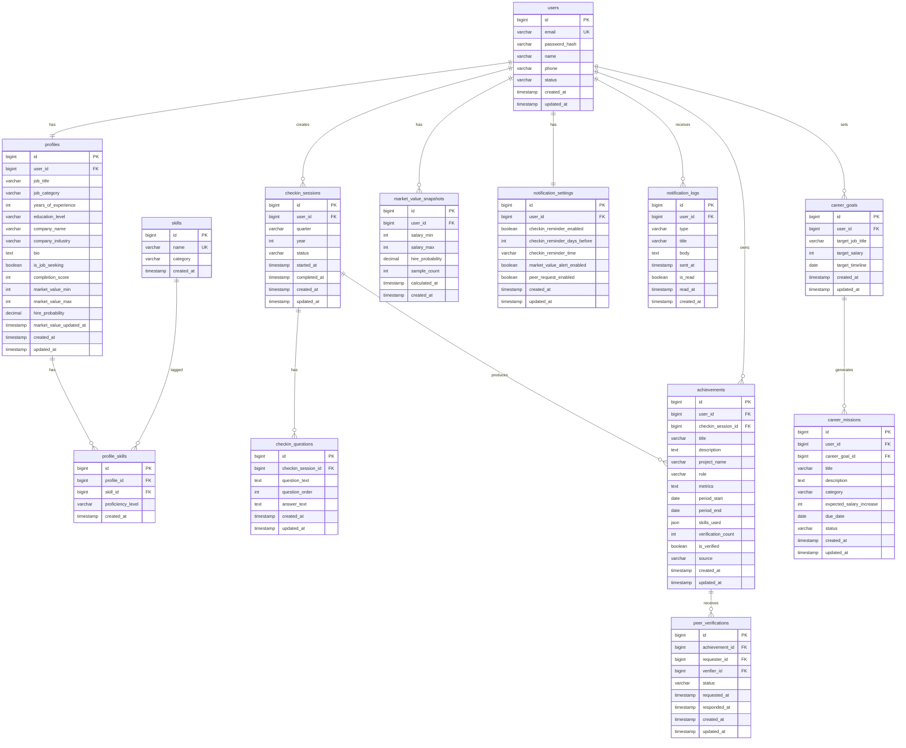

# Remember 프로필 다이어리 아키텍처 설계서

> 버전: v1.0
> 최종 수정일: 2026-02-19
> 작성자: architect agent
> 기준 문서: docs/PLAN.md v1.0

---

## 변경 이력

| 버전 | 날짜 | 변경 내용 |
|------|------|----------|
| v1.0 | 2026-02-19 | 최초 작성 (DB 스키마, API 명세, 폴더 구조) |

---

## 1. 기술 스택

| 영역 | 기술 | 선택 이유 |
|------|------|----------|
| **Backend** | NestJS (Node.js + TypeScript) | 클린 아키텍처 DI 지원, 데코레이터 기반 모듈화 |
| **Mobile** | React Native (Expo) | iOS/Android 동시 지원, 빠른 MVP 출시 |
| **Database** | PostgreSQL | 복잡한 집계 쿼리(마켓 밸류 계산), JSON 컬럼 지원 |
| **Cache** | Redis | 마켓 밸류 계산 결과 캐싱, 세션 관리 |
| **Queue** | Bull (Redis 기반) | 분기 알림 예약 발송, AI 질문 생성 비동기 처리 |
| **AI** | Claude API | 체크인 맞춤 질문 생성, 로그 파싱 NLP |
| **Push 알림** | FCM (Firebase Cloud Messaging) | iOS/Android 통합 푸시 발송 |
| **ORM** | TypeORM | NestJS 공식 지원, 마이그레이션 관리 |
| **인증** | JWT (Access 1h + Refresh 30d) | 모바일 환경 stateless 인증 |

---

## 2. DB 스키마

### 2.1 ERD (Mermaid)



---

### 2.2 테이블 명세

#### 테이블: users (사용자)

| 컬럼명 | 타입 | 제약조건 | 설명 |
|--------|------|----------|------|
| id | BIGINT UNSIGNED | PK, AUTO_INCREMENT | 사용자 고유 ID |
| email | VARCHAR(255) | NOT NULL, UNIQUE | 이메일 (로그인 ID) |
| password_hash | VARCHAR(255) | NOT NULL | bcrypt 해시 비밀번호 (cost 12) |
| name | VARCHAR(50) | NOT NULL | 실명 |
| phone | VARCHAR(20) | NULL | 휴대폰 번호 |
| status | VARCHAR(20) | NOT NULL, DEFAULT 'active' | active / suspended / deleted |
| created_at | TIMESTAMP | NOT NULL, DEFAULT NOW() | 생성 일시 |
| updated_at | TIMESTAMP | NOT NULL, DEFAULT NOW() | 수정 일시 |

**인덱스:** `idx_users_email` (email), `idx_users_status` (status)

---

#### 테이블: profiles (커리어 프로필)

| 컬럼명 | 타입 | 제약조건 | 설명 |
|--------|------|----------|------|
| id | BIGINT UNSIGNED | PK, AUTO_INCREMENT | 프로필 ID |
| user_id | BIGINT UNSIGNED | FK → users.id, UNIQUE | 1:1 관계 |
| job_title | VARCHAR(100) | NULL | 직함 (예: 시니어 마케터) |
| job_category | VARCHAR(50) | NULL | 직무 카테고리 (예: 마케팅) |
| years_of_experience | INT | NOT NULL, DEFAULT 0 | 총 경력 연차 |
| education_level | VARCHAR(30) | NULL | 최종 학력 |
| company_name | VARCHAR(100) | NULL | 현재 재직 회사명 |
| company_industry | VARCHAR(50) | NULL | 산업 분류 |
| bio | TEXT | NULL | 자기소개 |
| is_job_seeking | TINYINT(1) | NOT NULL, DEFAULT 0 | 구직 활성화 여부 |
| completion_score | INT | NOT NULL, DEFAULT 0 | 프로필 완성도 (0~100) |
| market_value_min | INT | NULL | 마켓 밸류 최솟값 (만원) |
| market_value_max | INT | NULL | 마켓 밸류 최댓값 (만원) |
| hire_probability | DECIMAL(5,2) | NULL | 채용 제안 수신 확률 (0~100) |
| market_value_updated_at | TIMESTAMP | NULL | 마켓 밸류 마지막 계산 일시 |
| created_at | TIMESTAMP | NOT NULL, DEFAULT NOW() | 생성 일시 |
| updated_at | TIMESTAMP | NOT NULL, DEFAULT NOW() | 수정 일시 |

**인덱스:** `idx_profiles_user_id` (user_id), `idx_profiles_job_category` (job_category), `uq_profiles_user_id` UNIQUE (user_id)

---

#### 테이블: skills (스킬 마스터)

| 컬럼명 | 타입 | 제약조건 | 설명 |
|--------|------|----------|------|
| id | BIGINT UNSIGNED | PK, AUTO_INCREMENT | 스킬 ID |
| name | VARCHAR(100) | NOT NULL, UNIQUE | 스킬명 (예: Python, SQL) |
| category | VARCHAR(50) | NOT NULL | 스킬 분류 (예: 언어, 툴, 방법론) |
| created_at | TIMESTAMP | NOT NULL, DEFAULT NOW() | 생성 일시 |

---

#### 테이블: profile_skills (프로필-스킬 연결)

| 컬럼명 | 타입 | 제약조건 | 설명 |
|--------|------|----------|------|
| id | BIGINT UNSIGNED | PK, AUTO_INCREMENT | ID |
| profile_id | BIGINT UNSIGNED | FK → profiles.id | 프로필 |
| skill_id | BIGINT UNSIGNED | FK → skills.id | 스킬 |
| proficiency_level | VARCHAR(20) | NOT NULL, DEFAULT 'intermediate' | beginner / intermediate / advanced / expert |
| created_at | TIMESTAMP | NOT NULL, DEFAULT NOW() | 생성 일시 |

**인덱스:** `uq_profile_skills` UNIQUE (profile_id, skill_id)

---

#### 테이블: checkin_sessions (분기별 체크인 세션)

| 컬럼명 | 타입 | 제약조건 | 설명 |
|--------|------|----------|------|
| id | BIGINT UNSIGNED | PK, AUTO_INCREMENT | 세션 ID |
| user_id | BIGINT UNSIGNED | FK → users.id | 사용자 |
| quarter | VARCHAR(2) | NOT NULL | Q1 / Q2 / Q3 / Q4 |
| year | INT | NOT NULL | 연도 (예: 2026) |
| status | VARCHAR(20) | NOT NULL, DEFAULT 'draft' | draft / in_progress / completed / skipped |
| started_at | TIMESTAMP | NULL | 작성 시작 일시 |
| completed_at | TIMESTAMP | NULL | 작성 완료 일시 |
| created_at | TIMESTAMP | NOT NULL, DEFAULT NOW() | 생성 일시 |
| updated_at | TIMESTAMP | NOT NULL, DEFAULT NOW() | 수정 일시 |

**인덱스:** `idx_checkin_sessions_user_id` (user_id), `uq_checkin_sessions_user_quarter` UNIQUE (user_id, quarter, year)

---

#### 테이블: checkin_questions (체크인 질문 & 답변)

| 컬럼명 | 타입 | 제약조건 | 설명 |
|--------|------|----------|------|
| id | BIGINT UNSIGNED | PK, AUTO_INCREMENT | 질문 ID |
| checkin_session_id | BIGINT UNSIGNED | FK → checkin_sessions.id | 세션 |
| question_text | TEXT | NOT NULL | AI 생성 질문 내용 |
| question_order | INT | NOT NULL | 질문 순서 (1~5) |
| answer_text | TEXT | NULL | 사용자 답변 |
| created_at | TIMESTAMP | NOT NULL, DEFAULT NOW() | 생성 일시 |
| updated_at | TIMESTAMP | NOT NULL, DEFAULT NOW() | 수정 일시 |

---

#### 테이블: achievements (성과 항목)

| 컬럼명 | 타입 | 제약조건 | 설명 |
|--------|------|----------|------|
| id | BIGINT UNSIGNED | PK, AUTO_INCREMENT | 성과 ID |
| user_id | BIGINT UNSIGNED | FK → users.id | 사용자 |
| checkin_session_id | BIGINT UNSIGNED | FK → checkin_sessions.id, NULL | 연결된 체크인 (없으면 수동 입력) |
| title | VARCHAR(200) | NOT NULL | 성과 제목 |
| description | TEXT | NULL | 상세 설명 |
| project_name | VARCHAR(100) | NULL | 프로젝트명 |
| role | VARCHAR(100) | NULL | 담당 역할 |
| metrics | TEXT | NULL | 성과 수치 (예: MAU 20% 개선) |
| period_start | DATE | NULL | 성과 기간 시작 |
| period_end | DATE | NULL | 성과 기간 종료 |
| skills_used | JSON | NULL | 사용 기술 목록 |
| verification_count | INT | NOT NULL, DEFAULT 0 | 인증 완료 수 |
| is_verified | TINYINT(1) | NOT NULL, DEFAULT 0 | 인증 여부 |
| source | VARCHAR(20) | NOT NULL, DEFAULT 'manual' | manual / checkin / ai_log |
| created_at | TIMESTAMP | NOT NULL, DEFAULT NOW() | 생성 일시 |
| updated_at | TIMESTAMP | NOT NULL, DEFAULT NOW() | 수정 일시 |
| deleted_at | TIMESTAMP | NULL | 소프트 삭제 일시 |

**인덱스:** `idx_achievements_user_id` (user_id), `idx_achievements_is_verified` (is_verified)

---

#### 테이블: peer_verifications (동료 상호 인증)

| 컬럼명 | 타입 | 제약조건 | 설명 |
|--------|------|----------|------|
| id | BIGINT UNSIGNED | PK, AUTO_INCREMENT | 인증 ID |
| achievement_id | BIGINT UNSIGNED | FK → achievements.id | 인증 대상 성과 |
| requester_id | BIGINT UNSIGNED | FK → users.id | 인증 요청자 |
| verifier_id | BIGINT UNSIGNED | FK → users.id | 인증자 |
| status | VARCHAR(20) | NOT NULL, DEFAULT 'pending' | pending / approved / rejected / cancelled |
| requested_at | TIMESTAMP | NOT NULL, DEFAULT NOW() | 요청 일시 |
| responded_at | TIMESTAMP | NULL | 응답 일시 |
| created_at | TIMESTAMP | NOT NULL, DEFAULT NOW() | 생성 일시 |
| updated_at | TIMESTAMP | NOT NULL, DEFAULT NOW() | 수정 일시 |

**인덱스:** `idx_peer_verifications_achievement_id` (achievement_id), `idx_peer_verifications_verifier_id` (verifier_id), `uq_peer_verifications` UNIQUE (achievement_id, verifier_id)

---

#### 테이블: market_value_snapshots (마켓 밸류 이력)

| 컬럼명 | 타입 | 제약조건 | 설명 |
|--------|------|----------|------|
| id | BIGINT UNSIGNED | PK, AUTO_INCREMENT | 스냅샷 ID |
| user_id | BIGINT UNSIGNED | FK → users.id | 사용자 |
| salary_min | INT | NOT NULL | 연봉 최솟값 (만원) |
| salary_max | INT | NOT NULL | 연봉 최댓값 (만원) |
| hire_probability | DECIMAL(5,2) | NOT NULL | 채용 확률 (0~100) |
| sample_count | INT | NOT NULL | 계산에 사용된 동일 직무 샘플 수 |
| calculated_at | TIMESTAMP | NOT NULL | 계산 시점 |
| created_at | TIMESTAMP | NOT NULL, DEFAULT NOW() | 저장 일시 |

**인덱스:** `idx_market_value_snapshots_user_id_calculated_at` (user_id, calculated_at DESC)

---

#### 테이블: notification_settings (알림 설정)

| 컬럼명 | 타입 | 제약조건 | 설명 |
|--------|------|----------|------|
| id | BIGINT UNSIGNED | PK, AUTO_INCREMENT | 설정 ID |
| user_id | BIGINT UNSIGNED | FK → users.id, UNIQUE | 사용자 (1:1) |
| checkin_reminder_enabled | TINYINT(1) | NOT NULL, DEFAULT 1 | 분기 체크인 알림 활성화 |
| checkin_reminder_days_before | INT | NOT NULL, DEFAULT 14 | 분기 말 며칠 전 발송 |
| checkin_reminder_time | VARCHAR(5) | NOT NULL, DEFAULT '09:00' | 발송 시각 (HH:MM) |
| market_value_alert_enabled | TINYINT(1) | NOT NULL, DEFAULT 1 | 마켓 밸류 알림 활성화 |
| peer_request_enabled | TINYINT(1) | NOT NULL, DEFAULT 1 | 동료 인증 요청 알림 활성화 |
| created_at | TIMESTAMP | NOT NULL, DEFAULT NOW() | 생성 일시 |
| updated_at | TIMESTAMP | NOT NULL, DEFAULT NOW() | 수정 일시 |

---

#### 테이블: notification_logs (알림 발송 이력)

| 컬럼명 | 타입 | 제약조건 | 설명 |
|--------|------|----------|------|
| id | BIGINT UNSIGNED | PK, AUTO_INCREMENT | 로그 ID |
| user_id | BIGINT UNSIGNED | FK → users.id | 수신 사용자 |
| type | VARCHAR(50) | NOT NULL | checkin_reminder / market_alert / peer_request / career_mission |
| title | VARCHAR(200) | NOT NULL | 알림 제목 |
| body | TEXT | NOT NULL | 알림 본문 |
| sent_at | TIMESTAMP | NOT NULL | 발송 일시 |
| is_read | TINYINT(1) | NOT NULL, DEFAULT 0 | 읽음 여부 |
| read_at | TIMESTAMP | NULL | 읽은 일시 |
| created_at | TIMESTAMP | NOT NULL, DEFAULT NOW() | 생성 일시 |

**인덱스:** `idx_notification_logs_user_id_is_read` (user_id, is_read)

---

#### 테이블: career_goals (커리어 목표) — Phase 3

| 컬럼명 | 타입 | 제약조건 | 설명 |
|--------|------|----------|------|
| id | BIGINT UNSIGNED | PK, AUTO_INCREMENT | 목표 ID |
| user_id | BIGINT UNSIGNED | FK → users.id | 사용자 |
| target_job_title | VARCHAR(100) | NOT NULL | 목표 직함 |
| target_salary | INT | NOT NULL | 목표 연봉 (만원) |
| target_timeline | DATE | NULL | 목표 달성 기한 |
| created_at | TIMESTAMP | NOT NULL, DEFAULT NOW() | 생성 일시 |
| updated_at | TIMESTAMP | NOT NULL, DEFAULT NOW() | 수정 일시 |

---

#### 테이블: career_missions (커리어 미션) — Phase 3

| 컬럼명 | 타입 | 제약조건 | 설명 |
|--------|------|----------|------|
| id | BIGINT UNSIGNED | PK, AUTO_INCREMENT | 미션 ID |
| user_id | BIGINT UNSIGNED | FK → users.id | 사용자 |
| career_goal_id | BIGINT UNSIGNED | FK → career_goals.id | 연결된 커리어 목표 |
| title | VARCHAR(200) | NOT NULL | 미션 제목 |
| description | TEXT | NULL | 미션 상세 |
| category | VARCHAR(30) | NOT NULL | skill / experience / certification |
| expected_salary_increase | INT | NULL | 달성 시 예상 연봉 상승액 (만원) |
| due_date | DATE | NULL | 완료 목표일 |
| status | VARCHAR(20) | NOT NULL, DEFAULT 'pending' | pending / in_progress / completed |
| created_at | TIMESTAMP | NOT NULL, DEFAULT NOW() | 생성 일시 |
| updated_at | TIMESTAMP | NOT NULL, DEFAULT NOW() | 수정 일시 |

---

## 3. API 명세

### 3.1 인증 방식

- **Access Token**: JWT, 만료 1시간, `Authorization: Bearer {token}` 헤더
- **Refresh Token**: JWT, 만료 30일, HttpOnly Cookie 저장
- **보호된 엔드포인트**: 🔒 표시된 모든 엔드포인트는 Authorization 헤더 필수

### 3.2 표준 응답 형식

**성공:**
```json
{ "success": true, "data": { } }
```
**실패:**
```json
{ "success": false, "error": { "code": "ERROR_CODE", "message": "한국어 메시지" } }
```

### 3.3 에러 코드 정의

| 코드 | HTTP | 설명 |
|------|------|------|
| `AUTH_INVALID_CREDENTIALS` | 401 | 이메일 또는 비밀번호 불일치 |
| `AUTH_TOKEN_EXPIRED` | 401 | 토큰 만료 |
| `PROFILE_NOT_FOUND` | 404 | 프로필 없음 |
| `CHECKIN_ALREADY_EXISTS` | 409 | 해당 분기 체크인 이미 존재 |
| `ACHIEVEMENT_NOT_FOUND` | 404 | 성과 항목 없음 |
| `VERIFICATION_ALREADY_SENT` | 409 | 동일 동료에게 이미 인증 요청 발송 |
| `VERIFICATION_SELF_REQUEST` | 400 | 본인에게 인증 요청 불가 |
| `MARKET_VALUE_INSUFFICIENT_DATA` | 422 | 마켓 밸류 계산을 위한 샘플 부족 |
| `VALIDATION_ERROR` | 422 | 입력값 유효성 오류 |

---

### 3.4 엔드포인트 목록

#### 인증 (Auth)

| 메서드 | 경로 | 인증 | 설명 |
|--------|------|------|------|
| POST | `/api/v1/auth/register` | - | 회원가입 |
| POST | `/api/v1/auth/login` | - | 로그인 |
| POST | `/api/v1/auth/logout` | 🔒 | 로그아웃 |
| POST | `/api/v1/auth/refresh` | - | 토큰 갱신 (Refresh Cookie) |

#### 프로필 (Profile)

| 메서드 | 경로 | 인증 | 설명 |
|--------|------|------|------|
| GET | `/api/v1/profile` | 🔒 | 내 프로필 조회 |
| PATCH | `/api/v1/profile` | 🔒 | 프로필 수정 |
| GET | `/api/v1/profile/completion-score` | 🔒 | 완성도 스코어 조회 |
| GET | `/api/v1/profile/skills` | 🔒 | 보유 스킬 목록 조회 |
| POST | `/api/v1/profile/skills` | 🔒 | 스킬 추가 |
| DELETE | `/api/v1/profile/skills/{skillId}` | 🔒 | 스킬 삭제 |

#### 분기 체크인 (Checkin)

| 메서드 | 경로 | 인증 | 설명 |
|--------|------|------|------|
| GET | `/api/v1/checkins` | 🔒 | 체크인 세션 목록 조회 |
| POST | `/api/v1/checkins` | 🔒 | 분기 체크인 세션 생성 |
| GET | `/api/v1/checkins/{id}` | 🔒 | 체크인 세션 상세 조회 |
| GET | `/api/v1/checkins/{id}/questions` | 🔒 | AI 생성 질문 목록 조회 |
| PATCH | `/api/v1/checkins/{id}/questions/{qId}` | 🔒 | 질문 답변 저장 |
| POST | `/api/v1/checkins/{id}/complete` | 🔒 | 체크인 완료 처리 |

#### 성과 항목 (Achievements)

| 메서드 | 경로 | 인증 | 설명 |
|--------|------|------|------|
| GET | `/api/v1/achievements` | 🔒 | 성과 목록 조회 (타임라인) |
| POST | `/api/v1/achievements` | 🔒 | 성과 수동 등록 |
| GET | `/api/v1/achievements/{id}` | 🔒 | 성과 상세 조회 |
| PATCH | `/api/v1/achievements/{id}` | 🔒 | 성과 수정 |
| DELETE | `/api/v1/achievements/{id}` | 🔒 | 성과 삭제 (소프트) |

#### 동료 인증 (Peer Verification)

| 메서드 | 경로 | 인증 | 설명 |
|--------|------|------|------|
| POST | `/api/v1/achievements/{id}/verifications` | 🔒 | 동료 인증 요청 발송 |
| GET | `/api/v1/verifications/received` | 🔒 | 받은 인증 요청 목록 조회 |
| POST | `/api/v1/verifications/{id}/approve` | 🔒 | 인증 승인 |
| POST | `/api/v1/verifications/{id}/reject` | 🔒 | 인증 거절 |
| DELETE | `/api/v1/verifications/{id}` | 🔒 | 인증 요청 취소 |

#### 마켓 밸류 (Market Value)

| 메서드 | 경로 | 인증 | 설명 |
|--------|------|------|------|
| GET | `/api/v1/market-value` | 🔒 | 현재 마켓 밸류 조회 |
| POST | `/api/v1/market-value/calculate` | 🔒 | 마켓 밸류 재계산 요청 |
| GET | `/api/v1/market-value/history` | 🔒 | 마켓 밸류 변화 이력 |
| GET | `/api/v1/market-value/benchmark` | 🔒 | 동일 직무 벤치마킹 데이터 |

#### 알림 (Notifications)

| 메서드 | 경로 | 인증 | 설명 |
|--------|------|------|------|
| GET | `/api/v1/notifications` | 🔒 | 알림 목록 조회 |
| POST | `/api/v1/notifications/{id}/read` | 🔒 | 알림 읽음 처리 |
| GET | `/api/v1/notifications/settings` | 🔒 | 알림 설정 조회 |
| PATCH | `/api/v1/notifications/settings` | 🔒 | 알림 설정 수정 |

#### 커리어 패스 (Career Path) — Phase 3

| 메서드 | 경로 | 인증 | 설명 |
|--------|------|------|------|
| POST | `/api/v1/career-goals` | 🔒 | 커리어 목표 설정 |
| GET | `/api/v1/career-goals` | 🔒 | 커리어 목표 조회 |
| GET | `/api/v1/career-goals/{id}/gap-analysis` | 🔒 | 갭 분석 리포트 조회 |
| GET | `/api/v1/career-goals/{id}/missions` | 🔒 | 분기 미션 목록 조회 |
| PATCH | `/api/v1/career-goals/{id}/missions/{mId}` | 🔒 | 미션 상태 업데이트 |

---

### 3.5 주요 API 상세 명세

#### POST /api/v1/checkins — 체크인 세션 생성 및 AI 질문 생성

```
- 설명: 현재 분기의 체크인 세션을 생성하고 Claude API로 맞춤 질문 3~5개를 비동기 생성
- 인증: 필요
- Rate Limit: 분기당 1회 (중복 생성 시 409 반환)

Request Body: 없음

Response 201:
{
  "success": true,
  "data": {
    "sessionId": 1,
    "quarter": "Q1",
    "year": 2026,
    "status": "in_progress",
    "questions": [
      { "id": 1, "order": 1, "text": "이번 분기 가장 임팩트 있었던 프로젝트는 무엇인가요?" },
      { "id": 2, "order": 2, "text": "KPI 달성률은 어느 정도였나요?" }
    ]
  }
}

Error Cases:
- 409 CHECKIN_ALREADY_EXISTS: 해당 분기 체크인이 이미 존재합니다.
```

---

#### POST /api/v1/checkins/{id}/complete — 체크인 완료 및 성과 자동 생성

```
- 설명: 답변 완료된 체크인을 최종 제출. 답변 기반으로 성과 항목을 자동 생성하고 완성도 스코어 및 마켓 밸류를 재계산.
- 인증: 필요

Response 200:
{
  "success": true,
  "data": {
    "completedAt": "2026-02-19T10:00:00Z",
    "completionScoreBefore": 62,
    "completionScoreAfter": 78,
    "marketValue": {
      "salaryMin": 6000,
      "salaryMax": 8000,
      "hireProbability": 73.5,
      "change": { "salaryMin": +300, "salaryMax": +300 }
    },
    "achievementsCreated": 2
  }
}
```

---

#### GET /api/v1/market-value — 마켓 밸류 조회

```
- 설명: 현재 마켓 밸류 및 동일 직무 대비 포지셔닝 반환
- 인증: 필요

Response 200:
{
  "success": true,
  "data": {
    "salaryMin": 6000,
    "salaryMax": 8000,
    "hireProbability": 73.5,
    "sampleCount": 142,
    "updatedAt": "2026-02-19T10:00:00Z",
    "positioning": {
      "percentile": 68,
      "strengths": ["Python", "데이터 분석"],
      "weaknesses": ["SQL", "머신러닝"]
    }
  }
}

Error Cases:
- 422 MARKET_VALUE_INSUFFICIENT_DATA: 동일 직무 샘플이 부족합니다. (현재 N개 / 최소 10개 필요)
```

---

#### POST /api/v1/achievements/{id}/verifications — 동료 인증 요청

```
- 설명: 특정 성과에 대해 명함 DB 확인된 동료에게 인증 요청 발송
- 인증: 필요

Request Body:
{
  "verifierUserId": 456
}

Response 201:
{
  "success": true,
  "data": {
    "verificationId": 10,
    "status": "pending",
    "verifier": { "id": 456, "name": "박지민", "company": "카카오" },
    "requestedAt": "2026-02-19T10:00:00Z"
  }
}

Error Cases:
- 409 VERIFICATION_ALREADY_SENT: 이미 해당 동료에게 인증 요청을 보냈습니다.
- 400 VERIFICATION_SELF_REQUEST: 본인에게 인증을 요청할 수 없습니다.
```

---

## 4. 프로젝트 폴더 구조

```
remember-profile-diary/
│
├── backend/                          # NestJS 백엔드
│   ├── src/
│   │   ├── domain/                   # 도메인 레이어 (비즈니스 핵심)
│   │   │   ├── user/
│   │   │   │   ├── user.entity.ts
│   │   │   │   └── user.repository.ts
│   │   │   ├── profile/
│   │   │   │   ├── profile.entity.ts
│   │   │   │   └── profile.repository.ts
│   │   │   ├── achievement/
│   │   │   │   ├── achievement.entity.ts
│   │   │   │   └── achievement.repository.ts
│   │   │   ├── checkin/
│   │   │   │   ├── checkin-session.entity.ts
│   │   │   │   ├── checkin-question.entity.ts
│   │   │   │   └── checkin.repository.ts
│   │   │   ├── peer-verification/
│   │   │   │   ├── peer-verification.entity.ts
│   │   │   │   └── peer-verification.repository.ts
│   │   │   ├── market-value/
│   │   │   │   ├── market-value-snapshot.entity.ts
│   │   │   │   └── market-value.repository.ts
│   │   │   ├── notification/
│   │   │   │   ├── notification-log.entity.ts
│   │   │   │   ├── notification-settings.entity.ts
│   │   │   │   └── notification.repository.ts
│   │   │   └── career/               # Phase 3
│   │   │       ├── career-goal.entity.ts
│   │   │       ├── career-mission.entity.ts
│   │   │       └── career.repository.ts
│   │   │
│   │   ├── application/              # 애플리케이션 레이어 (유스케이스)
│   │   │   ├── auth/
│   │   │   │   ├── login.use-case.ts
│   │   │   │   └── refresh-token.use-case.ts
│   │   │   ├── profile/
│   │   │   │   ├── get-profile.use-case.ts
│   │   │   │   └── update-profile.use-case.ts
│   │   │   ├── checkin/
│   │   │   │   ├── create-checkin-session.use-case.ts
│   │   │   │   ├── generate-ai-questions.use-case.ts
│   │   │   │   └── complete-checkin.use-case.ts
│   │   │   ├── achievement/
│   │   │   │   ├── create-achievement.use-case.ts
│   │   │   │   └── get-achievement-timeline.use-case.ts
│   │   │   ├── peer-verification/
│   │   │   │   ├── request-verification.use-case.ts
│   │   │   │   └── respond-verification.use-case.ts
│   │   │   ├── market-value/
│   │   │   │   └── calculate-market-value.use-case.ts
│   │   │   └── notification/
│   │   │       ├── send-checkin-reminder.use-case.ts
│   │   │       └── get-notifications.use-case.ts
│   │   │
│   │   ├── infrastructure/           # 인프라 레이어 (외부 연동)
│   │   │   ├── database/
│   │   │   │   ├── typeorm/
│   │   │   │   │   ├── entities/     # TypeORM ORM 모델
│   │   │   │   │   └── migrations/   # DB 마이그레이션
│   │   │   │   └── repositories/     # Repository 구현체
│   │   │   ├── ai/
│   │   │   │   ├── claude.client.ts  # Claude API 클라이언트
│   │   │   │   └── question-generator.service.ts
│   │   │   ├── push/
│   │   │   │   └── fcm.client.ts     # FCM 푸시 알림
│   │   │   ├── cache/
│   │   │   │   └── redis.client.ts   # Redis 캐시
│   │   │   └── queue/
│   │   │       ├── checkin-reminder.job.ts
│   │   │       └── market-value.job.ts
│   │   │
│   │   ├── presentation/             # 프레젠테이션 레이어 (HTTP)
│   │   │   └── http/
│   │   │       ├── auth/
│   │   │       │   ├── auth.controller.ts
│   │   │       │   └── dto/
│   │   │       ├── profile/
│   │   │       │   ├── profile.controller.ts
│   │   │       │   └── dto/
│   │   │       ├── checkin/
│   │   │       │   ├── checkin.controller.ts
│   │   │       │   └── dto/
│   │   │       ├── achievement/
│   │   │       │   ├── achievement.controller.ts
│   │   │       │   └── dto/
│   │   │       ├── peer-verification/
│   │   │       │   ├── peer-verification.controller.ts
│   │   │       │   └── dto/
│   │   │       ├── market-value/
│   │   │       │   ├── market-value.controller.ts
│   │   │       │   └── dto/
│   │   │       └── notification/
│   │   │           ├── notification.controller.ts
│   │   │           └── dto/
│   │   │
│   │   ├── common/                   # 공통 모듈
│   │   │   ├── guards/               # JWT 인증 가드
│   │   │   ├── filters/              # 전역 예외 필터
│   │   │   ├── interceptors/         # 응답 포맷 인터셉터
│   │   │   └── decorators/           # 커스텀 데코레이터
│   │   │
│   │   ├── config/                   # 환경설정
│   │   │   ├── database.config.ts
│   │   │   ├── jwt.config.ts
│   │   │   └── redis.config.ts
│   │   │
│   │   └── app.module.ts
│   │
│   ├── test/                         # 테스트 코드
│   │   ├── unit/
│   │   └── integration/
│   └── .env.example
│
├── mobile/                           # React Native (Expo)
│   ├── src/
│   │   ├── screens/                  # 화면 컴포넌트 (SCR-001 ~ SCR-011)
│   │   │   ├── CheckinScreen/
│   │   │   ├── MarketValueScreen/
│   │   │   ├── TimelineScreen/
│   │   │   ├── VerificationScreen/
│   │   │   └── ProfileScreen/
│   │   ├── components/               # 공통 UI 컴포넌트
│   │   │   ├── QuestionCard/
│   │   │   ├── AchievementCard/
│   │   │   ├── MarketValueChart/
│   │   │   └── VerificationBadge/
│   │   ├── navigation/               # React Navigation 설정
│   │   ├── stores/                   # Zustand 상태 관리
│   │   ├── api/                      # API 클라이언트 (Axios)
│   │   └── styles/                   # 디자인 토큰
│   └── app.json
│
└── docs/                             # 문서
    ├── PLAN.md
    ├── ARCHITECTURE.md               # 이 파일
    └── QA_REPORT.md
```

---

## 5. 아키텍처 결정 기록 (ADR)

| # | 결정 | 이유 | 트레이드오프 |
|---|------|------|------------|
| ADR-001 | PostgreSQL 선택 | 마켓 밸류 집계 쿼리, JSON 컬럼(skills_used) 지원 필요 | MySQL 대비 운영 비용 소폭 증가 |
| ADR-002 | 마켓 밸류 Redis 캐싱 | 계산 결과 5초 이내 응답 요건, 동일 직무 집계 비용 절감 | 캐시 무효화 전략 별도 관리 필요 |
| ADR-003 | AI 질문 생성 비동기 처리 | Claude API 응답 지연(1~3초) 동안 UI 블로킹 방지 | Bull Queue 인프라 추가 |
| ADR-004 | achievements 소프트 삭제 | 동료 인증 마크가 연결된 성과 물리 삭제 시 데이터 무결성 문제 | deleted_at 컬럼 및 필터링 로직 추가 |
| ADR-005 | AI 채팅 로그 클라이언트 처리 | 기업 기밀 포함 가능성, 서버 비저장 원칙 (법무 요건) | 서버 기반 NLP 품질 대비 정확도 낮을 수 있음 |
